# Universal Data Extractor

Turn public website listings into CSV, JSON and Excel deliverables using reusable YAML profiles. Choose Requests for static HTML or Playwright for JavaScript-rendered content, with optional validation, duplicate handling and rejection evidence.

**Status:** both engines have been manually verified end to end on Windows with Python 3.12. Hosted GitHub Actions passed on Ubuntu with Python 3.11/3.12 and Windows with Python 3.12. CI installs and launches Chromium against local in-memory HTML; live Books and Quotes scraping was verified manually during the release audit. macOS has not been verified.

Current release: [v1.0.0](https://github.com/nageshkumar13/universal-data-extractor/releases/tag/v1.0.0)

## Capabilities

- CSS field extraction, relative link resolution and explicit `record_selector` containers, with legacy inference preserved.
- Next-link pagination, page limits and a delay between page loads.
- Existing price, rating and availability transformations.
- Opt-in required-field and type validation, date conversion, `keep_first` or `report_only` duplicate policies, and JSON audit artifacts.
- Provenance passthrough when supplied to the quality processor; the runner does not currently attach source metadata automatically.
- CSV, JSON and XLSX output, robots awareness, strict final HTTP-status checks and bounded status retries.
- Run-level completion caching and deterministic completed/skipped CLI summaries.

## Verified demonstrations

These are live verification results from the September 2026 release audit, not permanent guarantees about third-party websites.

| Profile | Engine | Pages | Records | Notes |
|---|---|---:|---:|---|
| [Books](profiles/books.yaml) | Requests | 5 | 100 | Product titles, prices, ratings, availability and URLs |
| [Quotes](profiles/quotes_js.yaml) | Playwright Chromium | 3 | 30 | `quote`, `author` |

Both demonstrations produced CSV, JSON and XLSX. [Fake Jobs](profiles/jobs.yaml) is also bundled.

## Architecture

The runner loads and validates the profile once. The diagram shows the fresh-run data flow; matching completed runs skip the fetching and export stages.

```mermaid
flowchart LR
    CLI --> Runner[ScrapeRunner]
    Runner --> Loader[ProfileLoader]
    Loader --> Robots[Robots check]
    Robots --> Client[Requests or Playwright]
    Client --> Parser[HTMLParser]
    Parser --> Transformer
    Transformer --> Quality[Optional QualityProcessor]
    Quality --> Exporter
    Exporter --> Cache[Completion cache]
```



All pages accumulate before transformation and quality processing. The client closes before either stage. See [architecture and failure boundaries](docs/ARCHITECTURE.md).

## Installation

Use Python **3.11 or 3.12**, verified by hosted CI on Ubuntu; Windows Python 3.12 also passed hosted CI and was manually verified with real static and browser demonstrations.

```bash
git clone https://github.com/nageshkumar13/universal-data-extractor.git
cd universal-data-extractor
```

From the repository root, create and activate a virtual environment.

Windows PowerShell:

```powershell
python -m venv .venv
.\.venv\Scripts\Activate.ps1
```

POSIX shell:

```bash
python3 -m venv .venv
source .venv/bin/activate
```

Install runtime dependencies:

```bash
python -m pip install -r requirements.txt
```

Contributors also install the separate test requirements; these do not include the runtime file:

```bash
python -m pip install -r requirements-dev.txt
python -m pip check
```

Browser profiles additionally require the Chromium build associated with the installed Playwright package:

```bash
python -m playwright install chromium
```

Linux may also need OS libraries. On supported GitHub-hosted Ubuntu runners, CI uses `python -m playwright install --with-deps chromium`, as documented in [Playwright CI setup](https://playwright.dev/python/docs/ci). On a managed local machine, arrange any OS dependency installation with its administrator.

## Quick start

Run from the repository root with the virtual environment active:

```bash
python cli.py --profile profiles/books.yaml --clear-cache
python cli.py --profile profiles/quotes_js.yaml --clear-cache
```

`--clear-cache` clears **both** legacy URL rows and run-completion rows in the shared cache database, across profiles. It does not delete outputs. Omit it to allow an identical completed run to skip.

CLI summary excerpts below omit counters and paths for brevity. The full summary also lists cache/robots counters, data-quality status and CSV/JSON/XLSX paths.

Fresh Books run:

```text
Status: completed
Pages scraped: 5
Records extracted: 100
Records transformed: 100
Records exported: 100
```

Identical completed rerun:

```text
Status: skipped
Reason: completed output already exists
Pages scraped: 0
Cached skips: 5
```

Illustrative quality-enabled run with two required-field rejections:

```text
Status: completed
Pages scraped: 1
Records extracted: 10
Records transformed: 10
Clean records exported: 8
Records rejected: 2
```

Quality summaries also show `Data quality: enabled`, `Quality report:` and `Rejected records:` paths. A cached quality run reports `enabled (not run; cached skip)`. Robots-restricted runs report partial coverage and do not receive a completion marker.

## Profile example

This illustrative static profile uses explicit containers and opts into quality processing. It validates as configuration; `example.com` is a placeholder, not a demonstration target.

```yaml
site_name: Product Demo
engine: static
start_url: https://example.com/products
max_pages: 3
delay: 1
record_selector: article.product
pagination:
  next_button: "a.next"
data_quality: true
fields:
  title:
    selector: "h2::text"
    required: true
  product_url:
    selector: "a.details::attr(href)"
    type: URL
    required: true
unique_key: [product_url]
duplicate_policy: keep_first
```

Quality is off by default. Simple mappings such as `title: "h2::text"` remain valid in either mode. Extended field definitions and quality-only settings require `data_quality: true`. See the [complete profile reference](docs/PROFILE_REFERENCE.md) for selector, conversion and validation rules.

## Outputs and completion caching

The CLI writes under `data/` relative to the current working directory. The filename stem comes from `site_name`, lowercased with punctuation/whitespace collapsed to underscores. For Books it is `books_to_scrape`.

| Output | When written |
|---|---|
| `<stem>.csv`, `<stem>.json`, `<stem>.xlsx` | Every successful fresh/rebuild export, including empty datasets |
| `<stem>.quality.json` | Quality enabled: eight accounting counts |
| `<stem>.rejected.json` | Quality enabled: rejected records and reasons, or `[]` |

Normal exports contain only clean records when quality is enabled. Audit files are written before normal exports. Rejected `raw` values are the quality processor's input **after transformation**, not an untouched HTML extraction snapshot.

The default cache is `data/cache.db`. Completion belongs to the profile fingerprint and resolved output destination, not individual pages. Identical completed runs skip only if all required files are regular and non-empty. The completed-skip path is read-only and does not refresh reports or completion timestamps.

A missing/empty output or behavior-affecting profile change triggers a rebuild from page one. Changing profiles at the same destination transfers output ownership; returning to the earlier profile rebuilds. There is no partial-page resume, append or output merging. Source websites changing alone do not invalidate completion; use `--clear-cache` to refresh.

## HTTP failures and retries

Both engines require `200 <= final_status < 300` after redirects. Error HTML is not returned to the parser. Browser validation concerns the main document, not failed images or other subresources.

Final statuses **429, 500, 502, 503 and 504** get up to **four attempts total**, with backoff of **1, 2 and 4 seconds**. A valid `Retry-After` increases the delay when needed, up to 60 seconds. A larger requested delay stops retries rather than retrying too soon; malformed headers use backoff. Ordinary 4xx and other final non-2xx statuses fail without status retries.

Requests retains separate transport retries. Redirects, those retries and browser subresources mean four status attempts are not a four-network-request guarantee. A failed page stops the run before transformation, quality processing or export, leaving previous outputs unchanged and requiring a full rebuild next time.

## Tests and CI

```bash
python -m pytest -q
```

The deterministic suite uses fakes rather than live websites. [CI](.github/workflows/ci.yml) passed on Ubuntu 3.11/3.12 and Windows 3.12, installing declared dependencies and Chromium, checking dependency compatibility, launching Chromium against in-memory HTML, then running pytest. Normal CI deliberately does not scrape third-party websites and requires no site credentials. The live Books and Quotes results above came from manual release validation; external availability and DOM structure can change.

## Limitations and responsible use

- Respect website terms, robots policies and applicable law. Robots checks are not permission to scrape; robots-fetch errors currently fail open.
- No CAPTCHA or soft-block detection, proxy rotation or automatic protection bypass.
- No concurrent writers to the same output set. Files are not committed as one atomic filesystem transaction; later write failures can leave a mixed set without a completion marker.
- Non-empty cached files are not content-validated, and website changes do not automatically expire completion.
- There is no overall fetch deadline. Retry waits, redirects and browser subresources add work beyond the logical page count.
- Live profiles can drift. Pagination follows a next element's `href`; it does not click JS-only buttons or implement infinite scrolling.
- Provenance is supported by the quality processor when provided, but is not attached by the runner. Optional conversion failures become null rather than rejecting the record.
- macOS has not been verified.

## Repository layout

- [cli.py](cli.py): command entry point and summaries.
- [core/](core/): configuration, fetching, parsing, transformation, quality, cache and export.
- [profiles/](profiles/): Books, Fake Jobs and Quotes examples.
- [tests/](tests/): deterministic regression tests.
- [docs/ARCHITECTURE.md](docs/ARCHITECTURE.md): execution, lifecycle and failure boundaries.
- [docs/PROFILE_REFERENCE.md](docs/PROFILE_REFERENCE.md): supported configuration and examples.

The following historical milestone labels are retained unchanged; current behavior is described above.

## Release Milestones

| Version | Focus |
|---|---|
| v0.1.0 | End-to-end static extraction pipeline |
| v0.2.0 | SQLite cache and robots.txt awareness |
| v0.3.0 | Structured data transformation layer |
| v0.4.0 | Core unit test coverage |
| v0.5.0 | Multi-profile extraction support |
| v0.6.0 | Business-friendly Excel exports |
| v0.7.0 | Automated GitHub Actions test workflow |
| v0.8.0 | Runner-based orchestration |
| v0.8.1 | Static framework correctness fixes |
| v0.8.2 | Portfolio polish and repository hygiene |
| v1.0.0 | Quality processing, completion caching, explicit record selectors, verified browser extraction, bounded retries, CI and documentation |

## License

[MIT](LICENSE)
