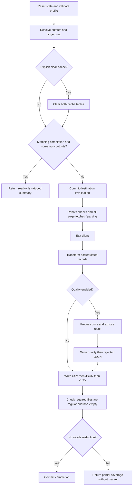

# Architecture

[README](../README.md) | [Profile reference](PROFILE_REFERENCE.md)

One run processes one profile and one output set. All pages accumulate before transformation or export. Quality is opt-in; legacy profiles retain their selector-string path.

## Components

| Component | Responsibility |
|---|---|
| [CLI](../cli.py) | Accept profile/clear-cache options, load environment variables, invoke runner and format summary |
| [ProfileLoader](../core/config.py) | Read safe YAML, reject duplicate keys, validate and expand quality fields |
| [ScrapeRunner](../core/runner.py) | Own the profile snapshot, lifecycle, accumulation and processing/export order |
| [URLCache](../core/cache.py) | SQLite legacy URL rows and independent run-completion state |
| [RobotsChecker](../core/robots.py) | Fetch robots.txt and check proposed page URLs |
| [Client factory](../core/client_factory.py) | Select Requests or Playwright behind a shared fetch/context-manager protocol |
| [HttpClient](../core/http_client.py) / [BrowserClient](../core/browser_client.py) | Fetch HTML, enforce final-status success and apply status retry policy |
| [Retry policy](../core/retry.py) | Calculate bounded status retries and Retry-After delays |
| [HTMLParser](../core/parser.py) / [Paginator](../core/pagination.py) | Extract aligned records and resolve next links |
| [Transformer](../core/transformers.py) | Existing field-name-based price/rating/availability conversions |
| [QualityProcessor](../core/quality.py) | Normalize, validate, handle duplicates and enforce counts |
| [Exporter](../core/exporter.py) | Normal formats and quality JSON sidecars |

## Execution sequence



1. Runner construction creates collaborators, including the default SQLite cache. Schema initialization can occur before profile validation; validation precedes client construction and network access.
2. Each `run()` clears `last_quality_result` and quality-enabled state, then loads one validated profile snapshot. Quality fields expand in that snapshot; a separate selector projection goes to the parser.
3. Output paths and fingerprint are computed. An explicit clear-cache request clears legacy URL and completion rows.
4. Matching completion plus all required non-empty regular output files returns immediately. This constructs no client, performs no robots request, processing or writes, and leaves `last_quality_result` as `None`.
5. Rebuild invalidation commits for this destination before client construction or requests. Unrelated destinations and legacy rows remain intact.
6. The runner creates the selected client and robots checker, then enters the client once around the entire page loop. It checks robots permission, applies the inter-page delay, fetches HTML, parses records and follows links until pagination ends or reaches the page limit.
7. Records accumulate in page/document order. The client exits before transformation, quality or export.
8. Transformation runs once. Only `profile.get("data_quality") is True` invokes quality, once with the whole transformed list and expanded profile. Only its clean records reach normal exporters.
9. The quality result is exposed before writing artifacts. Audit writes precede CSV, JSON and XLSX. All required files must be regular and non-empty before completion can be marked.
10. An unrestricted successful run writes one committed completion update as its final state-changing action, then returns the existing summary dictionary.

Genuine zero-record runs still process/export: non-empty blank CSV, JSON `[]`, empty workbook, and (when enabled) all-zero quality report plus rejected `[]`. They can be completed and skipped later. All-rejected runs write rejection evidence and empty normal outputs.

## Fetching, retries and lifecycle

Both engines follow ordinary redirects and require `200 <= final_status_code < 300`. Validation precedes returning usable content. Shared `HTTPStatusError` exposes `requested_url`, `final_url`, `status_code`, subclasses Requests' HTTPError, and uses `Fetch failed with HTTP <status> for <final-or-requested-url>`.

The shared policy retries final 429, 500, 502, 503 and 504, with four status attempts total. Backoff is 1, 2 and 4 seconds. Valid Retry-After delta-seconds or HTTP dates can increase waits; values over 60 seconds stop retries rather than being shortened. Invalid headers use backoff. Other final non-2xx statuses fail immediately. Every retry starts from the originally requested URL.

Requests retains separate adapter transport retries (three retries, backoff factor 1), with adapter status retries disabled. Transport errors retain existing Requests/urllib3 behavior. Browser navigation, selector, content and interruption errors are not converted to status retries. There is no overall fetch deadline; logical page counts do not count redirects, retries or browser subresources.

Playwright starts once per run, launches headless Chromium once and creates one shared context with default selector/navigation timeouts of 30 seconds. Each fetch attempt creates a page, navigates with `domcontentloaded`, validates the `page.goto()` main-document response, optionally waits for `wait_for`, then reads HTML. Missing navigation responses fail. Secondary resource failures do not independently fail status validation, though missing scripts may affect content.

Pages close in `finally`, including failed attempts. Context, browser and Playwright then close in order; every cleanup step is attempted, references are cleared and close is idempotent. Partial startup is cleaned up. Primary fetch/interruption errors survive cleanup errors. A close error after success propagates; a failed attempt's page-close failure aborts a pending retry.

The runner owns injected clients too. HttpClient's context manager closes its Requests session. Client cleanup occurs after parser errors and KeyboardInterrupt as well as fetch failures.

Robots fetching is separate from page-status/retry policy. Its urllib request has a 10-second timeout and fetch errors currently fail open. A disallowed page stops pagination, reports partial coverage and prevents completion marking; records already accumulated may still be exported. Robots checks are not legal permission.

## Parsing and transformation boundaries

Validated `record_selector` passes unchanged to the parser. Explicit containers yield one dictionary each in document order, including wholly missing records. Each field uses its first match; missing values are empty strings. Zero containers returns no records; nested matched containers each produce records.

A field selects the container itself only when its CSS portion is exactly equal to `record_selector`. Other selectors use the underlying descendant-selection behavior without rewriting or implicit self matching. See [selector details](PROFILE_REFERENCE.md#selector-and-container-behavior).

Without `record_selector`, legacy inference finds a common whitespace-separated CSS prefix or a common ancestor of each field's first match. Failed inference can raise. All three bundled profiles still use this path.

Text includes descendants and collapses whitespace. Attributes are stripped and href/src values resolved against the current page URL. Transformation then applies existing output-name-based conventions, not configurable profile rules. Transformation errors precede quality and do not become rejected records.

## Quality and artifacts

Quality processes the complete transformed list, so duplicates span pages. It does not mutate input/profile data and deep-copies rejection evidence. Required missing/null/invalid values reject records; optional conversion failures become null and increment `invalid_values`. Explicit keys compare normalized valid records; null-key records remain unkeyed.

Runtime checks enforce:

```text
extracted = valid_before_deduplication + rejected
exported = valid_before_deduplication - duplicates_removed
```

Here exported counts clean records ready for export, not successful filesystem writes.

Audit paths derive from CSV: `<stem>.quality.json`, then `<stem>.rejected.json`. The report contains exactly eight public counts. Rejections preserve raw processor input, normalized values, reasons and provenance slots. Raw input is already transformed. The runner does not attach provenance; absent values remain null.

Audit JSON is UTF-8, indented, preserves Unicode and ends with a newline. Each artifact uses a same-directory temporary file and replaces its target only after a complete write. Failure attempts temporary cleanup without masking the original exception or damaging the previous target. Native date evidence is serialized in ISO form.

Legacy/disabled runs do not touch old audit files. Completed skips do not replace reports with all-zero results.

## Completion identity and ownership

CLI output is under `data/` in the current working directory; programmatic callers supply `output_dir`. Normal and audit files share the site-name slug. There is no YAML output-directory setting.

The output key hashes the normalized, resolved canonical CSV path. A versioned fingerprint hashes that destination plus:

```text
site_name, engine, start_url, max_pages, delay, wait_for, pagination,
record_selector, fields, transform, transformation, transformations,
data_quality, unique_key, duplicate_policy, include_provenance
```

Expanded field metadata participates. Dictionary order does not change the digest; list order does. The three transformation-spelling keys are fingerprinted but inert, not supported configuration features. Unknown unrelated metadata is excluded. Omitted and explicit runtime defaults are not universally canonicalized to one identity.

Only hashes and completion metadata are stored, not the profile payload. One destination has one completion claim: after profile B replaces A's files, A must rebuild.

Completion does not inspect file content or source freshness, and software/dependency changes do not automatically invalidate it. Website or code changes may require an explicit refresh.

Legacy URL rows and public methods remain functional; the runner no longer reads/writes per-page rows or trusts them as completion evidence. Opening an old database adds completion state without deleting legacy data. Public full clear removes both tables' rows; internal recovery invalidates only the relevant destination.

## Failure boundaries and limits

- Fetch, parser, transformation or quality failure propagates before export; previous output bytes remain intact. Invalidated completion state forces a full rebuild next time.
- Quality failure leaves no completed result. After quality succeeds, the result remains accessible even if later writing fails.
- Audit failure prevents normal export. A failed second artifact can leave the first newly replaced.
- Normal exporter failure can leave earlier files replaced, but no completion marker. The next invocation rebuilds.
- Completion-write failure leaves no usable marker even if outputs exist. No finally block marks failure complete.
- Completed skips do not write data or refresh timestamps on an initialized database.
- There is no whole-output-set filesystem transaction or concurrent-writer coordination. Do not run competing writers against the same destination.
